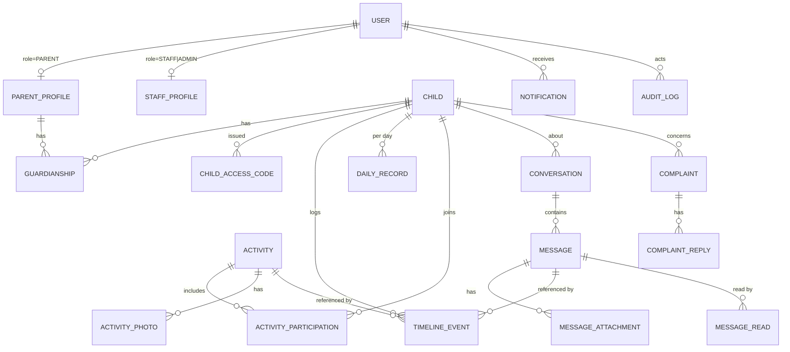

# Database Design

> Status: **Design baseline** · PostgreSQL 16 · Last updated: 2026-09-04
> All tables use UUID primary keys and `created_at` / `updated_at` timestamps.

---

## 1. ERD

---

## 2. Identity

### `accounts_user`
Custom user (`AbstractBaseUser`), **email is the login identifier**.

| Column | Type | Notes |
| --- | --- | --- |
| `id` | uuid PK | |
| `email` | citext UNIQUE NOT NULL | case-insensitive, login field |
| `password` | varchar | Argon2 hash |
| `first_name`, `last_name` | varchar(80) | |
| `phone` | varchar(30) | |
| `role` | varchar(10) NOT NULL | `PARENT` \| `STAFF` \| `ADMIN` |
| `is_active` | bool default true | deactivate instead of delete |
| `is_staff`, `is_superuser` | bool | Django admin only — **not** app roles |
| `last_login_at` | timestamptz null | |
| `created_at`, `updated_at` | timestamptz | |

> **`role` vs `is_staff`.** `is_staff` controls Django *admin* access only.
> Application authorisation reads `role`. Conflating them is a classic
> privilege-escalation bug, so they are kept strictly separate.

Indexes: `UNIQUE(email)`, `INDEX(role)`.

### `accounts_parentprofile`
`user_id` uuid PK/FK → user · `address` text · `emergency_phone` varchar(30) ·
`can_send_messages` bool default true · `preferred_language` varchar(5) default `'fr'`

### `accounts_staffprofile`
`user_id` uuid PK/FK → user · `job_title` varchar(80) ·
`assigned_age_group` varchar(20) null · `hired_on` date null · `is_active` bool

---

## 3. Guardianship & access codes

### `accounts_guardianship`
The **only** thing that grants a parent access to a child. All parent
authorisation derives from this table.

| Column | Type | Notes |
| --- | --- | --- |
| `id` | uuid PK | |
| `parent_id` | uuid FK → parentprofile, CASCADE | |
| `child_id` | uuid FK → child, CASCADE | |
| `relationship` | varchar(20) | `MOTHER` \| `FATHER` \| `GUARDIAN` \| `OTHER` |
| `is_primary` | bool default false | main contact |
| `granted_at` | timestamptz | |
| `revoked_at` | timestamptz null | **soft revoke** — keeps history |
| `granted_by_id` | uuid FK → user, SET NULL | audit |

Constraints & indexes:
- `UNIQUE (parent_id, child_id)` — one link per pair
- `INDEX (parent_id) WHERE revoked_at IS NULL` — the hot authorisation lookup
- `INDEX (child_id) WHERE revoked_at IS NULL`
- Partial `UNIQUE (child_id) WHERE is_primary AND revoked_at IS NULL` — at most
  one primary contact per child

### `accounts_childaccesscode`
The `MAM-7F42K` enrolment token. See [authentication.md](./authentication.md) §4.

| Column | Type | Notes |
| --- | --- | --- |
| `id` | uuid PK | |
| `child_id` | uuid FK → child, CASCADE | |
| `code_lookup` | char(64) UNIQUE NOT NULL | HMAC-SHA256 of the normalised code |
| `code_hint` | varchar(10) | e.g. `MAM-7F…` — for staff UI only, never the full code |
| `issued_by_id` | uuid FK → user, SET NULL | |
| `issued_at` | timestamptz | |
| `expires_at` | timestamptz | default +30 days |
| `claimed_at` | timestamptz null | single use |
| `claimed_by_id` | uuid FK → parentprofile, SET NULL | |
| `revoked_at` | timestamptz null | regenerating revokes the previous code |

- **The plaintext code is never stored.** It is shown to staff exactly once, at
  generation time.
- `code_lookup` is a *keyed* HMAC (not a salted password hash) precisely so it
  remains indexable for O(1) lookup while being useless if the DB leaks without
  the key.
- Partial `UNIQUE (child_id) WHERE claimed_at IS NULL AND revoked_at IS NULL`
  — at most one live code per child.

---

## 4. Children

### `children_child`

| Column | Type | Notes |
| --- | --- | --- |
| `id` | uuid PK | |
| `first_name`, `last_name` | varchar(80) NOT NULL | |
| `date_of_birth` | date NOT NULL | **the only age fact stored** |
| `gender` | varchar(10) | `M` \| `F` \| `OTHER` |
| `photo` | varchar(255) null | storage key |
| `registration_date` | date default today | |
| `allergies` | text blank | |
| `medical_notes` | text blank | restricted to staff |
| `notes` | text blank | |
| `status` | varchar(12) | `ACTIVE` \| `ARCHIVED` \| `WAITLIST` |
| `archived_at` | timestamptz null | soft delete |
| `archived_by_id` | uuid FK → user, SET NULL | |
| `created_at`, `updated_at` | timestamptz | |

Constraints & indexes:
- `CHECK (date_of_birth <= CURRENT_DATE)` — no future births
- `CHECK ((status = 'ARCHIVED') = (archived_at IS NOT NULL))` — status and
  timestamp can never disagree
- `INDEX (date_of_birth)` — drives age-group range filtering
- `INDEX (status) WHERE status = 'ACTIVE'`
- `INDEX (last_name, first_name)` and a trigram index for search

### 4.1 Age groups — exact boundaries

Age and group are **computed, never stored** (brief §8). Ages are in whole
months using calendar arithmetic (`relativedelta`), not `days / 30.44`.

| Key | French label | Rule (age in months `m`) |
| --- | --- | --- |
| `INFANT` | 2 → 6 mois | `m < 7` |
| `BABY` | 7 mois → 1 an | `7 ≤ m < 12` |
| `TODDLER` | 1 → 2 ans | `12 ≤ m < 24` |
| `PRESCHOOL` | 2 ans et + | `m ≥ 24` |

> **Boundary decision.** The brief's first group starts at 2 months, which
> leaves 0–2 months unclassifiable. Rather than fail or invent a fifth bucket,
> `INFANT` is a **catch-all below 7 months**, so every child always has exactly
> one group. Buckets are half-open (`[lower, upper)`) so a child turning 1 today
> is `TODDLER`, never both or neither.

**Filtering translates to a date range** so the `date_of_birth` index is used
(architecture.md §8.1):

| Group | Predicate |
| --- | --- |
| `INFANT` | `dob > today - 7 months` |
| `BABY` | `today - 12 months < dob ≤ today - 7 months` |
| `TODDLER` | `today - 24 months < dob ≤ today - 12 months` |
| `PRESCHOOL` | `dob ≤ today - 24 months` |

Tested boundary cases: exact birthday, day before/after, 29 February births,
end-of-month births (31 Aug → 28/29 Feb).

---

## 5. Care (`care` app)

### `care_timelineevent`
The unified event log. Full rationale in [timeline.md](./timeline.md).

| Column | Type | Notes |
| --- | --- | --- |
| `id` | uuid PK | |
| `child_id` | uuid FK → child, CASCADE | |
| `type` | varchar(20) NOT NULL | see timeline.md §3 |
| `occurred_at` | timestamptz NOT NULL | when it happened |
| `ended_at` | timestamptz null | intervals (sleep, activity) |
| `local_date` | date NOT NULL | nursery-local day, set on save |
| `title` | varchar(120) blank | overrides default type label |
| `description` | text blank | |
| `data` | jsonb default `{}` | type-validated payload |
| `activity_id` | uuid FK → activity, CASCADE, null | reference rows |
| `message_id` | uuid FK → message, CASCADE, null | reference rows |
| `is_published` | bool default false | parent visibility |
| `created_by_id` | uuid FK → user, SET NULL | |
| `created_at`, `updated_at` | timestamptz | |

Constraints & indexes:
- `CHECK (ended_at IS NULL OR ended_at >= occurred_at)` — no negative durations
- `CHECK (type <> 'ACTIVITY' OR activity_id IS NOT NULL)` — reference rows must
  actually reference
- `CHECK (type <> 'MESSAGE' OR message_id IS NOT NULL)`
- `INDEX (child_id, local_date, occurred_at)` — the timeline query
- `INDEX (child_id, occurred_at DESC)` — "latest events" widgets
- `INDEX (child_id, type, local_date)` — filtered views
- `UNIQUE (activity_id, child_id) WHERE activity_id IS NOT NULL` — an activity
  appears at most once per child's timeline

### `care_dailyrecord`
Day-scoped facts **not derivable** from events (timeline.md §3.1).

| Column | Type | Notes |
| --- | --- | --- |
| `id` | uuid PK | |
| `child_id` | uuid FK → child, CASCADE | |
| `date` | date NOT NULL | nursery-local |
| `general_notes` | text blank | |
| `status` | varchar(10) | `DRAFT` \| `PUBLISHED` |
| `published_at` | timestamptz null | |
| `created_by_id` | uuid FK → user, SET NULL | |

- `UNIQUE (child_id, date)` — one record per child per day
- `INDEX (date)`

> This table holds **no** meal/sleep/temperature columns. Those are aggregated
> from `care_timelineevent` at read time, which is why the daily view and the
> timeline can never disagree.

---

## 6. Activities

### `activities_activity`
`id` · `title` varchar(120) · `description` text · `date` date ·
`start_time` time null · `end_time` time null · `category` varchar(20) ·
`created_by_id` FK → user · timestamps

- `CHECK (end_time IS NULL OR start_time IS NULL OR end_time >= start_time)`
- `INDEX (date DESC)`

### `activities_activityparticipation`
`id` · `activity_id` FK CASCADE · `child_id` FK CASCADE · `note` text ·
`created_at`

- `UNIQUE (activity_id, child_id)`
- `INDEX (child_id, activity_id)`

### `activities_activityphoto`
`id` · `activity_id` FK CASCADE · `image` varchar(255) · `thumbnail` varchar(255) ·
`caption` varchar(200) · `order` int · `uploaded_by_id` FK → user

---

## 7. Messaging

### `messaging_conversation`
`id` · `child_id` FK → child CASCADE · `subject` varchar(150) ·
`last_message_at` timestamptz null · `is_closed` bool · timestamps

- `INDEX (child_id, last_message_at DESC)`
- Conversations are **scoped to a child** — this is what makes parent
  authorisation a reuse of the same guardianship check as everything else.

### `messaging_message`
`id` · `conversation_id` FK CASCADE · `sender_id` FK → user SET NULL ·
`body` text · `created_at`

- `INDEX (conversation_id, created_at DESC)`

### `messaging_messageattachment`
`id` · `message_id` FK CASCADE · `file` varchar(255) · `content_type` varchar(60) ·
`size_bytes` int · `thumbnail` varchar(255) null

- `CHECK (size_bytes <= 10485760)` — 10 MB ceiling enforced in the DB too

### `messaging_messageread`
`id` · `message_id` FK CASCADE · `user_id` FK CASCADE · `read_at` timestamptz

- `UNIQUE (message_id, user_id)` — read receipts, and the source of the
  "unread" counts on both dashboards

---

## 8. Complaints

### `complaints_complaint`
`id` · `parent_id` FK → parentprofile · `child_id` FK → child null ·
`subject` varchar(150) · `message` text · `status` varchar(12) ·
`assigned_to_id` FK → staffprofile null · `resolved_at` timestamptz null ·
timestamps

- `status ∈ {NEW, IN_PROGRESS, RESOLVED, CLOSED}`
- `INDEX (status, created_at DESC)` · `INDEX (parent_id, created_at DESC)`
- Transitions are enforced in the service layer:
  `NEW → IN_PROGRESS → RESOLVED → CLOSED`, with `NEW → CLOSED` allowed for
  duplicates. Backward transitions are rejected.

### `complaints_complaintreply`
`id` · `complaint_id` FK CASCADE · `author_id` FK → user SET NULL ·
`body` text · `is_internal` bool default false · `created_at`

- `is_internal` replies are **never** serialised to parents (staff notes).

---

## 9. Notifications & audit

### `notifications_notification`
`id` · `user_id` FK CASCADE · `type` varchar(30) · `title` varchar(150) ·
`body` text · `link` varchar(255) · `read_at` timestamptz null ·
`child_id` FK null · `created_at`

- `INDEX (user_id, read_at, created_at DESC)` — unread badge query

### `audit_auditlog`
`id` · `actor_id` FK → user SET NULL · `action` varchar(50) ·
`object_type` varchar(50) · `object_id` uuid null · `child_id` FK null ·
`ip_address` inet null · `user_agent` varchar(255) · `metadata` jsonb ·
`created_at`

- `INDEX (child_id, created_at DESC)` · `INDEX (actor_id, created_at DESC)`
- **Append-only**: no update/delete path is exposed anywhere in the application.

---

## 10. Business rules enforced at the database level

Rules that must never be violated live in the schema, not only in Python —
application bugs shouldn't be able to corrupt children's records.

1. A child cannot be born in the future.
2. `status = ARCHIVED` ⟺ `archived_at IS NOT NULL`.
3. An event's end cannot precede its start.
4. `ACTIVITY` / `MESSAGE` events must carry their reference FK.
5. One live (unclaimed, unrevoked) access code per child.
6. One guardianship per (parent, child); at most one primary guardian.
7. One daily record per (child, date).
8. A child appears at most once per activity.
9. Attachments cannot exceed 10 MB.

---

## 11. Data protection

- Children's data is deleted only by explicit admin action; `ARCHIVED` is the
  default end state.
- `medical_notes` and `allergies` are staff-only fields, excluded from the
  parent serializer.
- Access-code plaintext exists only in the HTTP response that creates it.
- Media paths are UUID-based and non-enumerable; access goes through a
  permission-checked view, never a public directory listing.
- `audit_auditlog` retains who read or changed a child's record.
